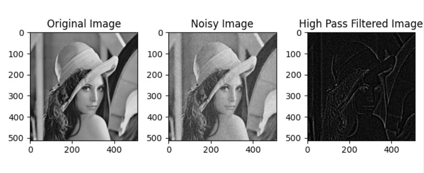

# Image Processing Toolbox

## Overview

Welcome to our Image Processing Toolbox repository! This project explores a variety of image processing techniques aimed at enhancing, analyzing, and compressing images. 
The implementation includes modules for high pass and low pass filtering, wavelet transform, and inverse wavelet transform. 
Additionally, a user-friendly graphical user interface (GUI) has been developed to provide a seamless experience for users, allowing them to perform various image processing operations effortlessly.

## Key Features

### 1. Filters
- **High Pass FIR Filter:** Effectively filters high-frequency components, aiding in edge detection.
  
- **Low Pass FIR Filter:** Smoothens images by filtering out high-frequency noise.

### 2. Data Compression
- **Haar Wavelet Transform:** Provides efficient data compression, reducing image size while maintaining essential information.
- **Signal Recovery:** Recovers the compressed image to its original form.

### 3. User Interface
- **GUI Toolbox:** A user-friendly graphical interface allowing users to perform all operations with a single click.
- **Seamless Experience:** The GUI streamlines the entire image processing workflow, enhancing user convenience.

## Usage

1. Clone the repository to your local machine.
2. Open the GUI application (`gui.py`).
3. Load an image and choose from various image processing options available in the toolbox.
4. Explore the results in real-time and observe the impact of different techniques on the images.

## Conclusion

This project demonstrates the versatility and potential of image processing techniques for image analysis and enhancement.
The combination of high pass and low pass filtering, wavelet transforms, and data compression through Haar wavelets showcases the power of our toolbox. 
The intuitive GUI ensures a user-friendly experience, making image processing accessible to a broader audience.

Feel free to explore, contribute, and provide feedback. Happy image processing!
